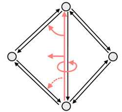
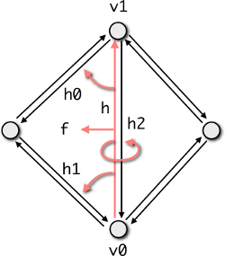

# Tutorial {#tutorial}

This section provides a hands-on tutorial on the basic usage of the
pmp-library. For a thorough introduction into polygon mesh processing we refer
to the book of Botsch et al. \cite botsch_2010_polygon.

## Introduction

In general, a polygonal surface mesh is composed of vertices, edges and faces as
well as the incidence relationships between them. pmp::SurfaceMesh stores the
connectivity information based on halfedges, i.e., pairs of directed edges with
opposing direction. To be more precise:

- Each vertex stores an outgoing halfedge.
- Each face stores an incident halfedge.
- Each halfedge stores its incident face, its target vertex, and its previous
  and next halfedges within the face.

The halfedge connectivity is illustrated in the figure below:



In the following sections we describe the basic usage of pmp::SurfaceMesh by
means of simple example programs and code excerpts.

## Basics

The very basic usage of pmp::SurfaceMesh is demonstrated in the example below. The
program first instantiates a pmp::SurfaceMesh object as well as four vertex
handles. These handles, as well as the handles for the other mesh entities
`Halfedge`, `Edge` and `Face` basically indices. Four vertices are added to the
mesh, as well as four triangular faces composing a tetrahedron. Finally, the
number of vertices, edges, and faces is printed to standard output.

```cpp
// instantiate a SurfaceMesh object
SurfaceMesh mesh;

// instantiate 4 vertex handles
Vertex v0,v1,v2,v3;

// add 4 vertices
v0 = mesh.add_vertex(Point(0,0,0));
v1 = mesh.add_vertex(Point(1,0,0));
v2 = mesh.add_vertex(Point(0,1,0));
v3 = mesh.add_vertex(Point(0,0,1));

// add 4 triangular faces
mesh.add_triangle(v0,v1,v3);
mesh.add_triangle(v1,v2,v3);
mesh.add_triangle(v2,v0,v3);
mesh.add_triangle(v0,v2,v1);

std::cout << "vertices: " << mesh.n_vertices() << std::endl;
std::cout << "edges: "    << mesh.n_edges()    << std::endl;
std::cout << "faces: "    << mesh.n_faces()    << std::endl;
```

## Iterators and Circulators

In order to sequentially access mesh entities pmp::SurfaceMesh provides
iterators for each entity type, namely pmp::SurfaceMesh::VertexIterator,
pmp::SurfaceMesh::HalfedgeIterator, pmp::SurfaceMesh::EdgeIterator, and
pmp::SurfaceMesh::FaceIterator. Similar to iterators, pmp::SurfaceMesh also
provides circulators for the ordered enumeration of all incident vertices,
halfedges, or faces around a given face or vertex. The example below
demonstrates the use of iterators and circulators for computing the mean valence
of a mesh.

```cpp
SurfaceMesh mesh;

if (argc > 1)
    mesh.read(argv[1]);

float mean_valence = 0.0f;

// loop over all vertices
for (auto v : mesh.vertices())
{
    // sum up vertex valences
    mean_valence += mesh.valence(v);
}

mean_valence /= mesh.n_vertices();

std::cout << "mean valence: " << mean_valence << std::endl;
```

## Dynamic Properties

Attaching additional attributes to mesh entities is important for many
applications. pmp::SurfaceMesh supports properties by means of synchronized arrays
that can be (de-)allocated dynamically at run-time. Property arrays are also
used internally, e.g., to store vertex coordinates. The example program below
shows how to access vertex coordinates through the (pre-defined) point property.

```cpp
SurfaceMesh mesh;

if (argc > 1)
    mesh.read(argv[1]);

// get (pre-defined) property storing vertex positions
auto points = mesh.get_vertex_property<Point>("v:point");

Point p(0,0,0);

for (auto v : mesh.vertices())
{
    // access point property like an array
    p += points[v];
}

p /= mesh.n_vertices();

std::cout << "barycenter: " << p << std::endl;
```

The dynamic (de-)allocation of properties at run-time is managed by a set
of four different functions:

- `add_EntityType_property<PropertyType>("PropertyName")` allocates a new property
  for the given _EntityType_ of the type _PropertyType_ labeled by the
  _PropertyName_ string.
- `get_EntityType_property<PropertyType>("PropertyName")` returns a handle to an
  existing property.
- `_EntityType_property<PropertyType>("PropertyName")` returns a handle to an
  existing property if the specified property already exists. If not, a new
  property is allocated and its handle is returned.
- `remove_EntityType_property(PropertyHandle)` removes and the property referenced
  by `PropertyHandle`.

Functions that allocate a new property take a default value for the property as
an optional second argument. The code excerpt below demonstrates how to
allocate, use and remove a custom edge property.

```cpp
SurfaceMesh mesh;

// allocate property storing a point per edge
auto edge_points = mesh.add_edge_property<Point>("propertyName");

// access the edge property like an array
Edge e;
edge_points[e] = Point(x,y,z);

// remove property and free memory
mesh.remove_edge_property(edge_points);
```

In addition to the per-entity properties described above it is also possible to
attach global per-object properties to a mesh. This can be used, e.g., for
storing minimum or maximum values of a scalar field or for storing a set of
region markers present in the mesh:

```cpp
auto markers = mesh.object_property<std::vector<int>>("o:regions");
markers[0].push_back(0);
markers[0].push_back(1);
```

Note in the above that access to the object property simply uses a zero index
since there is no concept of an object handle.

## Connectivity Queries

Commonly used connectivity queries such as retrieving the next
halfedge or the target vertex of an halfedge are illustrated below.

```cpp
Halfedge h;
auto h0 = mesh.next_halfedge(h);
auto h1 = mesh.prev_halfedge(h);
auto h2 = mesh.opposite_halfedge(h);
auto f  = mesh.face(h);
auto v0 = mesh.from_vertex(h);
auto v1 = mesh.to_vertex(h);
```



## Topological Operations

pmp::SurfaceMesh also offers higher-level topological operations, such as
performing edge flips, edge splits, face splits, or halfedge collapses. The
figure below illustrates some of these operations.


The corresponding member functions and their syntax is demonstrated in the
pseudo-code below.

```cpp
Vertex   v;
Edge     e;
Halfedge h;
Face     f;

mesh.split(f, v);
mesh.split(e, v);
mesh.flip(e);
mesh.collapse(h);
```

When entities are removed from the mesh due to topological changes, the member
function pmp::SurfaceMesh::garbage_collection() has to be called in order to
ensure the consistency of the data structure.

## File I/O

All I/O operations are handled by the pmp::SurfaceMesh::read() and
pmp::SurfaceMesh::write() member functions. Those functions simply take a file
name as well as optional pmp::IOFlags as an argument.

We currently support reading and writing several standard (and not so standard)
file formats: OFF, OBJ, STL, PLY, PMP, XYZ, AGI. See the reference documentation
for the pmp::SurfaceMesh::read() and pmp::SurfaceMesh::write() functions for
details on which format supports reading / writing which type of data.

A simple example reading and writing a mesh is shown below.

```cpp
// instantiate a SurfaceMesh object
SurfaceMesh mesh;

// read a mesh specified as the first command line argument
if (argc > 1)
    mesh.read(argv[1]);

// ...
// do fancy stuff with the mesh
// ...

// write the mesh to the file specified as second argument
if (argc > 2)
    mesh.write(argv[2]);
```

## Eigen Interoperability

The pmp-library supports some level of interoperability with Eigen. The
pmp::Matrix and pmp::Vector classes can be constructed/assigned from Eigen
matrix/vector types. In addition, it possible to cast the pmp::Matrix and
pmp::Vector classes to Eigen.

Example for construction:

```cpp
    // construction from Eigen
    Eigen::Vector3d eigenVec(1.0, 2.0, 3.0);
    pmp::dvec3 pmpVec = eigenVec;
```

Example for assignment:

```cpp
    // assignment from Eigen
    Eigen::Vector3d eigenVec(1.0, 2.0, 3.0);
    pmp::dvec3 pmpVec;
    pmpVec = eigenVec;
```

Example for cast:

```cpp
    // cast to Eigen
    pmp::vec3 pmpVec(1.0, 2.0, 3.0);
    Eigen::Vector3f eigenVec = static_cast<Eigen::Vector3f>(pmpVec);
```

See the reference documentation for pmp::Matrix and pmp::Vector for more details.
